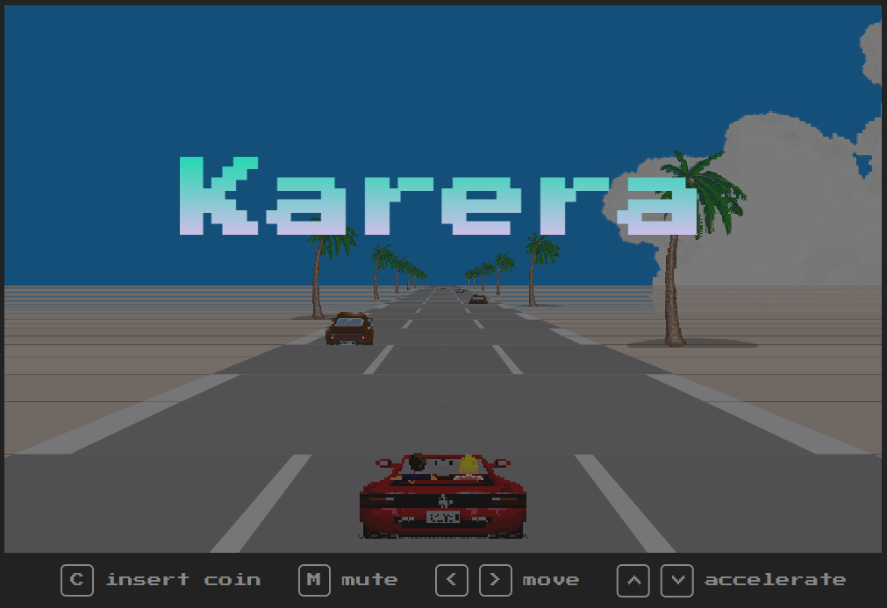

# KARERA

## **🌟 I. Overview**  

**KARERA** is a web-based racing game designed to provide an exciting and immersive experience that eliminates boredom. With engaging gameplay and dynamic challenges, **KARERA** keeps players entertained while offering a fun and interactive way to pass the time. This project aims to deliver enjoyment and a sense of thrill to users of all ages.

  

---

## **🎮 II. How to play Karera** 
- **Start the Game:** Press C to insert a coin, which starts the game. Once the coin is inserted, a countdown from 3 will begin before the race starts.
- **Mute/Unmute Music:** Press M to mute or unmute the background music, depending on your preference.
- **Control Your Vehicle:** Use the < and > arrow keys to move left and right and use the ^ arrow key to accelerate and the v arrow key to decelerate.

---

## **📹 III. Video Demonstration**
Experience PINDOT in action! Watch the video below to see how it works:

[Video Demonstration](https://drive.google.com/file/d/1bCKzEduGCRNmorQ_gpcnfvDQUBGHBJ5l/view?usp=sharing)

---

## **🏗 IV. System Architecture**  

### **Technologies:**  
- **HTML:** Used to structure the content and layout of the web page, providing the foundation for the game interface.
- **CSS:** Used to style and design the web page, ensuring an appealing and responsive visual experience across devices.
- **JavaScript:** Used to add interactivity, implement game logic, and handle user inputs, making the game functional and engaging.

---

## 👨‍💻 V. Developer 
Meet the man behind **KARERA**:   
- [Guinoban, Glenn M.](https://github.com/glngnbn)  
- CS - 3102

---
